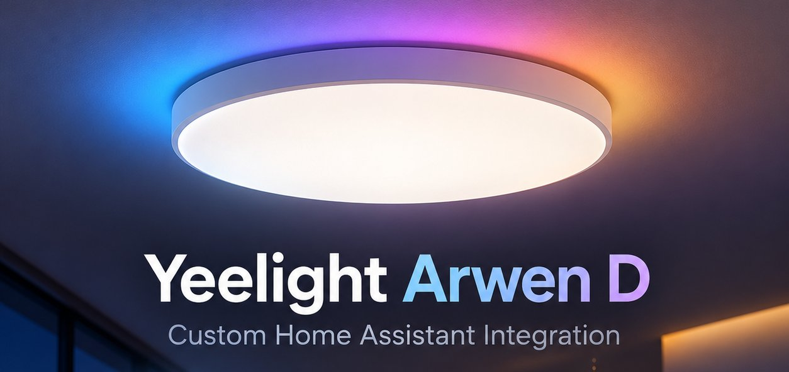

# Yeelight Arwen D for Home Assistant

Custom integration for the Yeelight Arwen D ceiling lights
(`yeelink.light.ceil43`), controlled entirely over the local network.

Tested with the Arwen 600D (about 60 cm, YLXDD-0150, firmware 2.1.7_0018). The
smaller Arwen 500D (about 50 cm, YLXDD-0149) is sold as the same product ("Arwen Ceiling
Light D") and most likely uses the same model ID and firmware, so it should work
as well, but has not been tested. The setup dialog accepts lamps that report
`yeelink.light.ceil43`; reports from 500D owners are welcome.

- Product page: [Arwen Ceiling Light D Series](https://en.yeelight.com/product/arwen-ceiling-light-d-series/) (Yeelight)
- Device specification: [`yeelink.light.ceil43`](https://home.miot-spec.com/spec/yeelink.light.ceil43) (Xiaomi MIoT)
- The lamp cannot be added to the Yeelight app or enabled for Yeelight LAN
  control: [Yeelight forum thread](https://forum.yeelight.com/t/topic/37030)

The official Xiaomi Home integration sends MIoT property writes, which carry no
fade time, and receives state changes through the Xiaomi cloud. The lamp does
not offer the Yeelight LAN protocol (TCP 55443). It does accept the Yeelight
command set over miIO (UDP 54321), including fade times and the effects of the
addressable main light. This integration uses those commands.

## Features

- **Primary light** (`light.yeelight_arwen_d_primary_light`): on/off,
  brightness, color temperature (2700-6500 K), RGB, transitions.
- **Effects** on the primary light: `Night light` (with its own
  brightness) and the 16 effects of the Mi Home app (Glittering, Pinball,
  Deep Sea, Rainbow, Green Shade, Ice Cream, Waxing Moon, Green Hills, Bonfire,
  Party, Garden, Winter, Heartbeat, Christmas, Sunset, Fantasy). The effect
  `off` returns to white light.
- **Ambient light** (`light.yeelight_arwen_d_ambient_light`): on/off,
  brightness, color temperature, RGB, transitions.
- **Buttons** for the primary light, like the keys of the remote: Toggle,
  Brightness up/down, Color temperature up/down. The lamp applies its own
  step size.
- **Action `yeelight_arwen_d.adjust`** for both lights: change brightness
  and/or color temperature by a percentage (-100 to 100) of the full range,
  computed by the lamp from its current value. Useful for dimmers and rotary
  knobs, because Home Assistant's `brightness_step` starts from the last
  reported value, which lags behind during a transition.

  ```yaml
  action: yeelight_arwen_d.adjust
  target:
    entity_id: light.yeelight_arwen_d_primary_light
  data:
    brightness_step: -10
    transition: 0.3
  ```
- State is read locally every 3 s with one `get_prop` call, and right after
  every command. The lamp sends no local push updates, so changes from the
  Mi Home app or the remote appear with up to 3 s delay.
- **Diagnostic sensors**: Wi-Fi signal (dBm), IP address and last restart,
  from `miIO.info`, read about once a minute.
- **Configuration** (settings of the Mi Home app, stored in the lamp):
  - `Ambient follows primary light`: the ambient light turns on and off with
    the primary light.
  - `Remember last state`: after power returns, the lamp restores its last
    state.
  - `Wall switch mode`: for operation with a Mi wall switch.
  - `Default transition` (30-10000 ms): the fade the lamp uses when a command
    carries no fade time.

Without a `transition` the lamp fades for its `Default transition`.
`transition: 0` switches instantly.

## Requirements

- Home Assistant 2025.8 or newer.
- The lamp's 32-character miIO token, for example from
  [Xiaomi-cloud-tokens-extractor](https://github.com/PiotrMachowski/Xiaomi-cloud-tokens-extractor).
  The token changes when the lamp is reset and paired again.

No fixed IP address is needed. The setup dialog lists the lamps that answer a
miIO broadcast (hello packet to UDP 54321) by IP address and device ID; an IP
address can also be typed in. The device ID is stored with the entry. When the
lamp stops answering, the integration broadcasts again (at most once a minute),
and if the lamp answers under a different IP address, that address is used and
saved.

The lamp stays usable in the Mi Home app.

## Installation

**HACS:**

[](https://my.home-assistant.io/redirect/hacs_repository/?owner=mvoss96&repository=ha-yeelight-arwen-d&category=integration)

Or by hand: HACS → three-dot menu → *Custom repositories* → add
`https://github.com/mvoss96/ha-yeelight-arwen-d` with type *Integration*. Then
download **Yeelight Arwen D** and restart Home Assistant.

**Manual:** copy `custom_components/yeelight_arwen_d` into the
`custom_components` folder of the Home Assistant configuration and restart.

Then add the integration **Yeelight Arwen D**, pick the lamp and enter the
token:

[](https://my.home-assistant.io/redirect/config_flow_start/?domain=yeelight_arwen_d)

A new token or IP address can be entered later with *Reconfigure* on the
integration entry, without losing the entities.

## Protocol notes

Commands are sent without the `user.` prefix that the method names carry in the
firmware; prefixed calls are dropped silently.

| Function | Command |
|---|---|
| Power | `set_power ["on"/"off", "smooth", ms, mode]` with mode 1 = white, 2 = RGB, 5 = night light |
| Brightness / color temperature / color | `set_bright`, `set_ct_abx`, `set_rgb` with `"smooth", ms` |
| Night light | `set_scene ["nightlight", percent, "smooth", ms]` |
| Effect | `set_fx [1, index, "<preset>"]` |
| Ambient light | `bg_set_power`, `bg_set_bright`, `bg_set_ct_abx`, `bg_set_rgb` |
| State | `get_prop [...]` |

`color_mode` of the main light: 1 = RGB, 2 = white (night light when `nl_br` > 0),
14 = effect (`current_effect_index`). `bg_lmode` of the ambient light: 1 = RGB,
2 = white.

Debug logging of all sent commands:

```yaml
logger:
  logs:
    custom_components.yeelight_arwen_d: debug
```

## About

This integration was developed with the help of
[Claude Code](https://claude.com/claude-code). The protocol details were worked
out and verified on a real Arwen 600D. The header image and the integration
icon are AI-generated.

Not affiliated with Yeelight or Xiaomi. Licensed under the [MIT License](LICENSE).
